# Plots-Makie

## [template](./template)

### [Plots.jl](./template/plots.jl)

### [Makie.jl](./template/makie.jl)
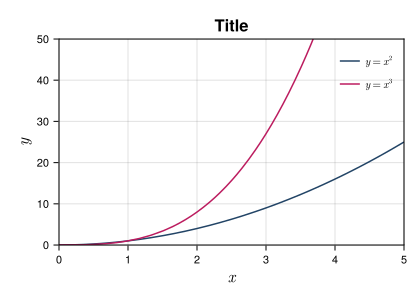

## [Hello](./hello)

### [Plots.jl](./hello/plots.jl)
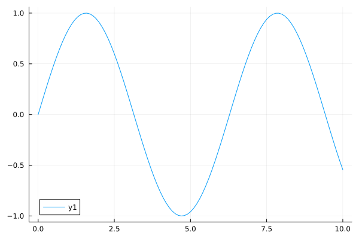

### [Makie.jl](./hello/makie.jl)
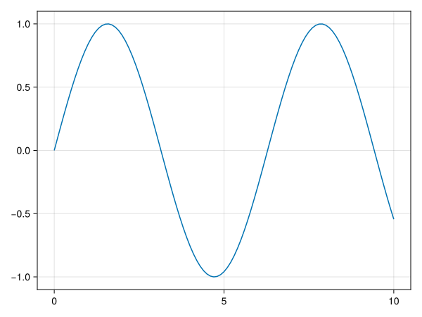

## [Lines](./lines)

### [Plots.jl](./lines/plots.jl)
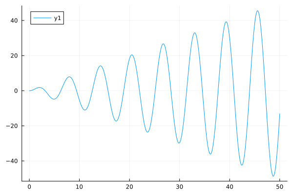

### [Makie.jl](./lines/makie.jl)
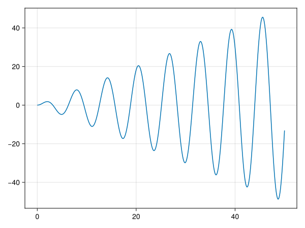

## [Scatter](./scatter)

### [Plots.jl](./scatter/plots.jl)
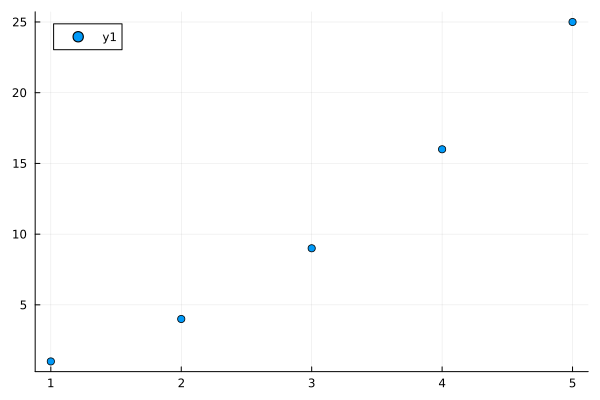

### [Makie.jl](./scatter/makie.jl)
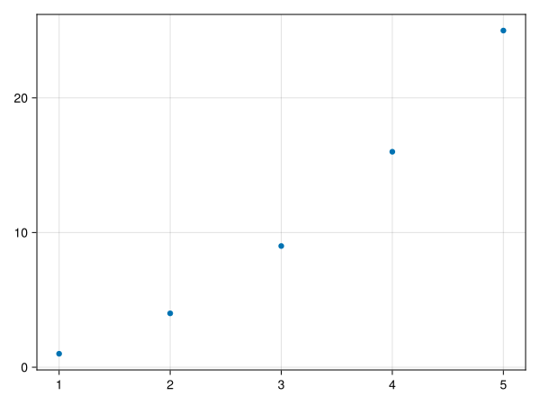

## [Histogram](./histogram)

### [Plots.jl](./histogram/plots.jl)
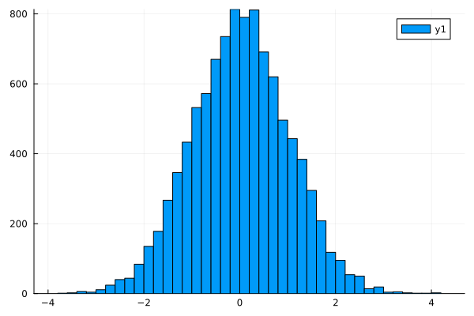

### [Makie.jl](./histogram/makie.jl)
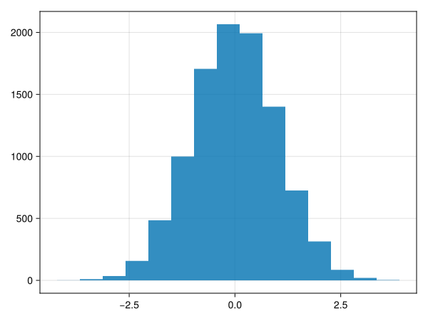

## [Surface](./surface)

### [Plots.jl](./surface/plots.jl)
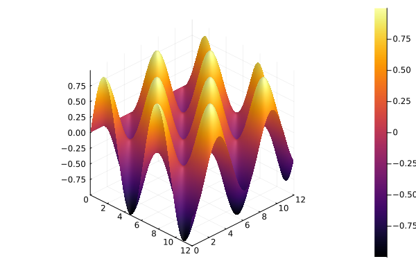

### [Makie.jl](./surface/makie.jl)
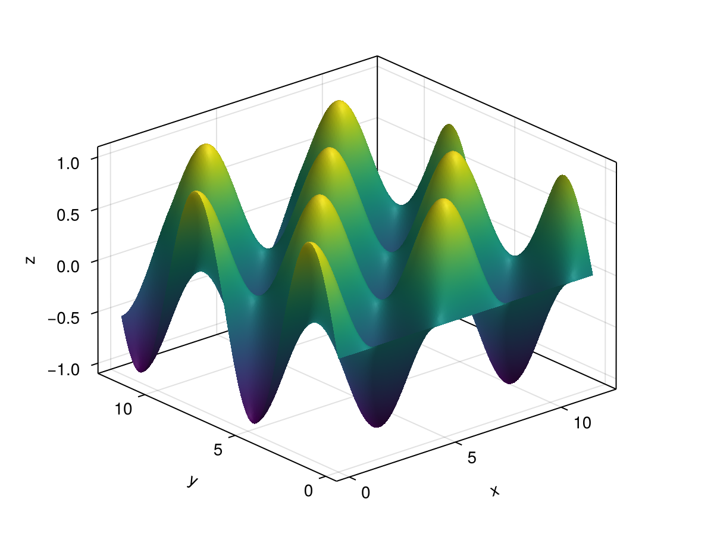

## [Heatmap](./heatmap)

### [Plots.jl](./heatmap/plots.jl)
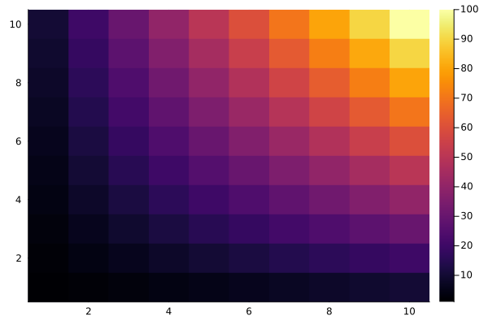

### [Makie.jl](./heatmap/makie.jl)
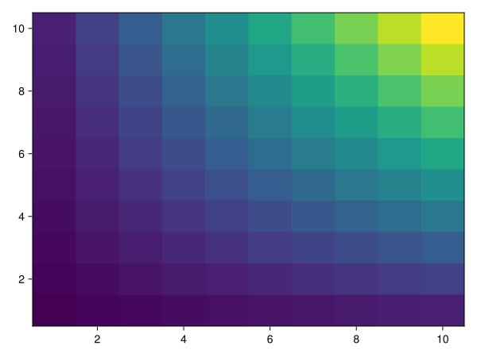

## [Subplot](./subplot)

### [Plots.jl](./subplot/plots.jl)
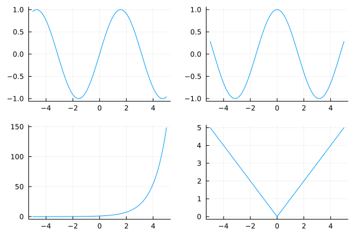

### [Makie.jl](./subplot/makie.jl)
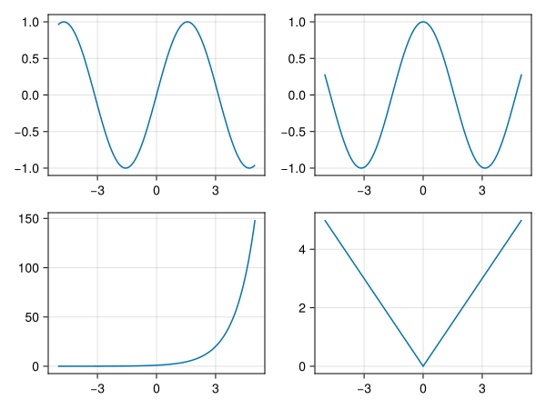

## [Grid](./grid)

### [Plots.jl](./grid/plots.jl)
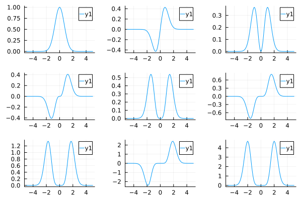

### [Makie.jl](./grid/makie.jl)
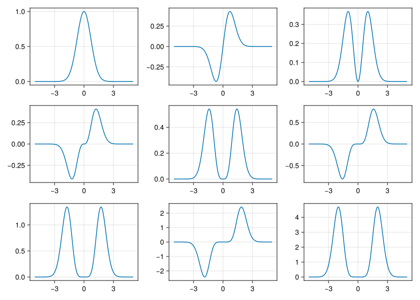

## [Text](./text)

### [Plots.jl](./text/plots.jl)
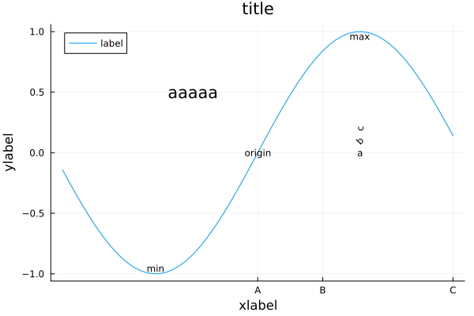

### [Makie.jl](./text/makie.jl)
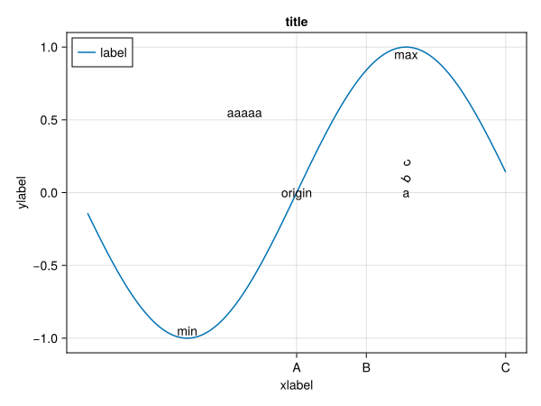

## [Artistic](./artistic)

### [Plots.jl](./artistic/plots.jl)
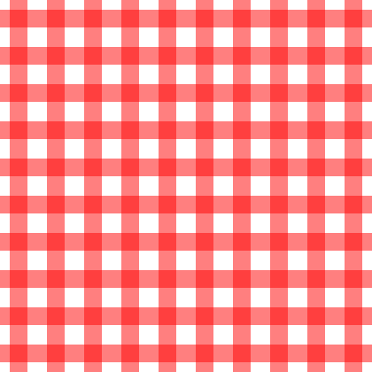

### [Makie.jl](./artistic/makie.jl)

## [Animation](./animation)

### [Plots.jl](./animation/plots.jl)
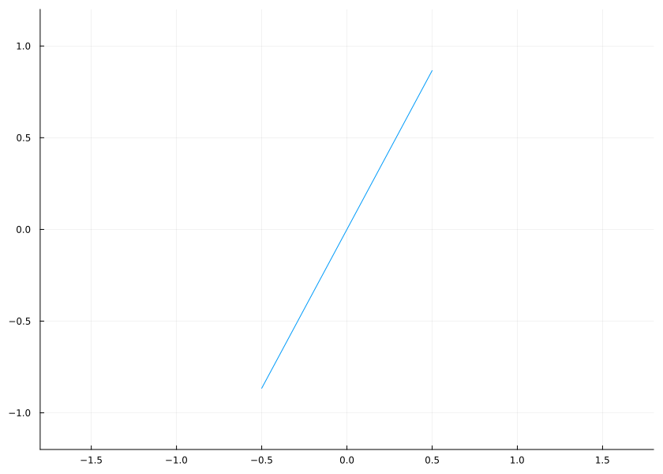

### [Makie.jl](./animation/makie.jl)
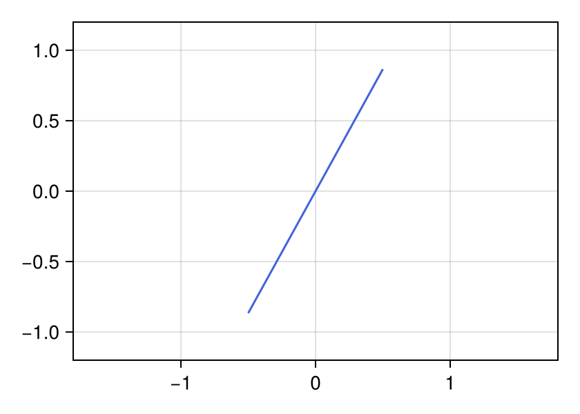
